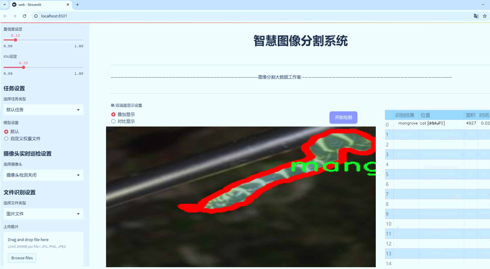
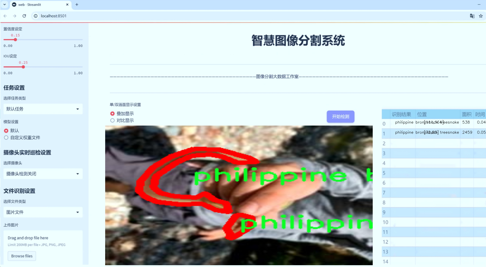
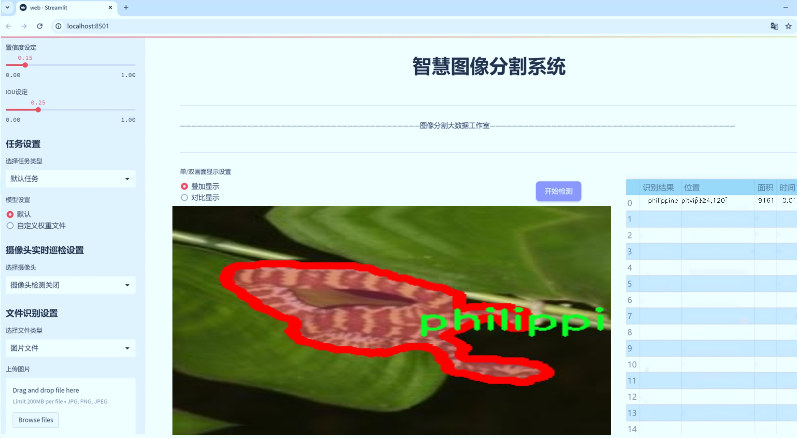
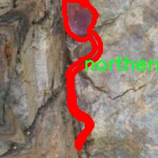
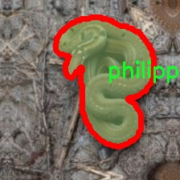
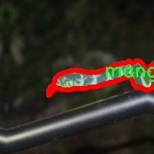
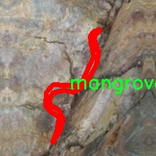
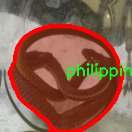

# 蛇类识别图像分割系统源码＆数据集分享
 [yolov8-seg-C2f-Faster＆yolov8-seg-C2f-ODConv等50+全套改进创新点发刊_一键训练教程_Web前端展示]

### 1.研究背景与意义

项目参考[ILSVRC ImageNet Large Scale Visual Recognition Challenge](https://gitee.com/YOLOv8_YOLOv11_Segmentation_Studio/projects)

项目来源[AAAI Global Al lnnovation Contest](https://kdocs.cn/l/cszuIiCKVNis)

研究背景与意义

随着全球生物多样性保护意识的增强，蛇类作为生态系统中重要的组成部分，其保护与研究逐渐受到重视。蛇类不仅在生态平衡中扮演着关键角色，同时也因其独特的生物特性和多样的栖息环境，成为生物学、生态学及环境科学等领域研究的热点。然而，传统的蛇类识别和分类方法往往依赖于人工观察和专家知识，效率低下且容易受到主观因素的影响。因此，基于计算机视觉技术的自动化识别与分割系统应运而生，成为解决这一问题的重要手段。

在众多计算机视觉技术中，YOLO（You Only Look Once）系列模型因其高效的实时目标检测能力而广泛应用于各类图像处理任务。YOLOv8作为该系列的最新版本，结合了深度学习和卷积神经网络的优势，能够在保持高精度的同时，实现快速的图像处理。针对蛇类的识别与分割，YOLOv8的引入为我们提供了一个强有力的工具，能够在复杂的自然环境中有效识别和分割出不同种类的蛇类，为后续的生态研究和保护工作提供数据支持。

本研究基于改进的YOLOv8模型，旨在构建一个高效的蛇类识别图像分割系统。我们使用的数据集“Snakes CALABARZON pt. 2”包含9700张图像，涵盖25个蛇类类别，包括常见的如眼镜蛇、红尾绿鼠蛇等。这一丰富的数据集不仅为模型的训练提供了充足的样本，也为不同蛇类的特征提取和分类提供了良好的基础。通过对该数据集的深入分析和处理，我们能够提取出各类蛇的独特特征，从而提高模型的识别准确率和分割效果。

此外，蛇类的多样性和复杂性使得其识别与分割任务具有一定的挑战性。不同种类的蛇在形态、颜色和栖息环境上存在显著差异，这对模型的泛化能力提出了更高的要求。因此，本研究不仅关注模型的基本性能提升，还将探索改进YOLOv8的多种策略，如数据增强、迁移学习和模型集成等，以进一步提高识别与分割的准确性和鲁棒性。

通过本研究，我们期望能够为蛇类的生态监测和保护提供一种新的技术手段，促进蛇类研究的自动化和智能化发展。同时，构建的图像分割系统也可为其他生物物种的识别与分类提供借鉴，推动计算机视觉技术在生物多样性保护领域的应用。总之，本研究不仅具有重要的学术价值，也为生态保护实践提供了实用的工具和方法，具有广泛的社会意义。

### 2.图片演示







##### 注意：由于此博客编辑较早，上面“2.图片演示”和“3.视频演示”展示的系统图片或者视频可能为老版本，新版本在老版本的基础上升级如下：（实际效果以升级的新版本为准）

  （1）适配了YOLOV8的“目标检测”模型和“实例分割”模型，通过加载相应的权重（.pt）文件即可自适应加载模型。

  （2）支持“图片识别”、“视频识别”、“摄像头实时识别”三种识别模式。

  （3）支持“图片识别”、“视频识别”、“摄像头实时识别”三种识别结果保存导出，解决手动导出（容易卡顿出现爆内存）存在的问题，识别完自动保存结果并导出到tempDir中。

  （4）支持Web前端系统中的标题、背景图等自定义修改，后面提供修改教程。

  另外本项目提供训练的数据集和训练教程,暂不提供权重文件（best.pt）,需要您按照教程进行训练后实现图片演示和Web前端界面演示的效果。

### 3.视频演示

[3.1 视频演示](https://www.bilibili.com/video/BV1UZ1VY6Ekc/)

### 4.数据集信息展示

##### 4.1 本项目数据集详细数据（类别数＆类别名）

nc: 15
names: ['mangrove cat snake', 'northern short-headed snake', 'paradise tree snake', 'philippine blunt-headed catsnake', 'philippine bronzeback treesnake', 'philippine cat snake', 'philippine cobra', 'philippine pitviper', 'philippine stripe-lipped', 'philippine whip snake', 'red-tailed green ratsnake', 'reddish rat snake', 'reinhardts lined snake', 'reticulated python', 'smooth-scaled mountain rat snake']


##### 4.2 本项目数据集信息介绍

数据集信息展示

在进行蛇类识别与图像分割的研究中，数据集的选择至关重要。本研究所采用的数据集名为“Snakes CALABARZON pt. 2”，该数据集专门针对菲律宾地区的蛇类进行分类和标注，具有丰富的多样性和较高的应用价值。该数据集包含15个不同的蛇类类别，涵盖了该地区的多种蛇种，提供了一个理想的基础，以训练和改进YOLOv8-seg模型在蛇类识别和图像分割任务中的表现。

在这15个类别中，首先是“mangrove cat snake”，这是一种适应于红树林生态系统的蛇类，具有独特的栖息习性和外观特征。其次是“northern short-headed snake”，以其短小的头部和灵活的身体而闻名，常见于菲律宾的森林和草地。接下来是“paradise tree snake”，这种蛇以其绚丽的色彩和优雅的姿态受到研究者的关注，常栖息于树木间，展示出出色的伪装能力。

此外，数据集中还包括“philippine blunt-headed catsnake”和“philippine bronzeback treesnake”，这两种蛇类在当地生态系统中扮演着重要角色。前者以其钝头特征而得名，后者则因其光滑的鳞片和优雅的体态而受到青睐。还有“philippine cat snake”和“philippine cobra”，这两种蛇类不仅在外观上具有显著差异，且在生态环境中各自占据着不同的生态位，提供了丰富的研究素材。

“philippine pitviper”和“philippine stripe-lipped”是该数据集中的另一对重要成员，前者以其毒性和独特的捕猎方式而闻名，后者则因其特有的唇部特征而受到关注。这些蛇类的存在为研究者提供了对蛇类生态和行为的深入理解。

数据集中还包含“philippine whip snake”和“red-tailed green ratsnake”，这两种蛇类以其灵活的捕猎技巧和适应性而著称。尤其是“red-tailed green ratsnake”，因其鲜艳的绿色和红色尾巴而受到许多自然爱好者的喜爱，成为观察和研究的热门对象。接下来的“reddish rat snake”和“reinhardts lined snake”则展示了蛇类在不同栖息环境中的适应性，前者常见于农田和草地，后者则在湿润的森林中栖息。

最后，“reticulated python”和“smooth-scaled mountain rat snake”作为数据集中的重要组成部分，前者是世界上最长的蛇类之一，后者则以其光滑的鳞片和山地栖息习性而闻名。这些蛇类的多样性不仅为研究提供了丰富的样本，也为训练改进YOLOv8-seg模型提供了广泛的应用场景。

综上所述，“Snakes CALABARZON pt. 2”数据集凭借其丰富的蛇类种类和独特的生态背景，为蛇类识别与图像分割的研究提供了坚实的基础。通过对这些数据的深入分析与处理，研究者能够更好地理解蛇类的特征及其在生态系统中的作用，从而推动相关领域的进一步发展。











### 5.全套项目环境部署视频教程（零基础手把手教学）

[5.1 环境部署教程链接（零基础手把手教学）](https://www.bilibili.com/video/BV1jG4Ve4E9t/?vd_source=bc9aec86d164b67a7004b996143742dc)


[5.2 安装Python虚拟环境创建和依赖库安装视频教程链接（零基础手把手教学）](https://www.bilibili.com/video/BV1nA4VeYEze/?vd_source=bc9aec86d164b67a7004b996143742dc)

### 6.手把手YOLOV8-seg训练视频教程（零基础小白有手就能学会）

[6.1 手把手YOLOV8-seg训练视频教程（零基础小白有手就能学会）](https://www.bilibili.com/video/BV1cA4VeYETe/?vd_source=bc9aec86d164b67a7004b996143742dc)


按照上面的训练视频教程链接加载项目提供的数据集，运行train.py即可开始训练



     Epoch   gpu_mem       box       obj       cls    labels  img_size
     1/200     0G   0.01576   0.01955  0.007536        22      1280: 100%|██████████| 849/849 [14:42<00:00,  1.04s/it]
               Class     Images     Labels          P          R     mAP@.5 mAP@.5:.95: 100%|██████████| 213/213 [01:14<00:00,  2.87it/s]
                 all       3395      17314      0.994      0.957      0.0957      0.0843

     Epoch   gpu_mem       box       obj       cls    labels  img_size
     2/200     0G   0.01578   0.01923  0.007006        22      1280: 100%|██████████| 849/849 [14:44<00:00,  1.04s/it]
               Class     Images     Labels          P          R     mAP@.5 mAP@.5:.95: 100%|██████████| 213/213 [01:12<00:00,  2.95it/s]
                 all       3395      17314      0.996      0.956      0.0957      0.0845

     Epoch   gpu_mem       box       obj       cls    labels  img_size
     3/200     0G   0.01561    0.0191  0.006895        27      1280: 100%|██████████| 849/849 [10:56<00:00,  1.29it/s]
               Class     Images     Labels          P          R     mAP@.5 mAP@.5:.95: 100%|███████   | 187/213 [00:52<00:00,  4.04it/s]
                 all       3395      17314      0.996      0.957      0.0957      0.0845


### 7.50+种全套YOLOV8-seg创新点代码加载调参视频教程（一键加载写好的改进模型的配置文件）

[7.1 50+种全套YOLOV8-seg创新点代码加载调参视频教程（一键加载写好的改进模型的配置文件）](https://www.bilibili.com/video/BV1Hw4VePEXv/?vd_source=bc9aec86d164b67a7004b996143742dc)

### 8.YOLOV8-seg图像分割算法原理

原始YOLOv8-seg算法原理

YOLOv8-seg是2023年1月由Ultralytics推出的一款先进的目标检测与实例分割模型，它在YOLO系列的基础上进行了多项创新和改进，旨在实现更高的精度和更快的处理速度。作为YOLO系列的最新版本，YOLOv8-seg结合了YOLOv5、YOLOv6、YOLOv7和PP-YOLOE等前辈模型的优点，尤其在头部标签分配和损失函数方面进行了深度优化。这些改进使得YOLOv8-seg在实时检测领域达到了一个新的高度，极大地推动了目标检测技术的发展。

YOLOv8-seg的核心在于其独特的网络结构和高效的算法设计。模型的整体架构分为三个主要部分：输入端、主干网络（Backbone）和检测端（Head）。在输入端，YOLOv8-seg接受图像数据并进行预处理，以适应后续的特征提取和目标检测。主干网络负责从输入图像中提取丰富的特征信息，而检测端则负责将这些特征映射到具体的目标类别和位置。

在主干网络的设计上，YOLOv8-seg采用了新的C2f模块，这一模块在传统的C3模块基础上进行了改进，增加了更多的跳层连接和Split操作。这种设计不仅提高了网络的灵活性，还增强了梯度信息的传递，使得模型在训练过程中能够更好地捕捉到复杂的特征。此外，YOLOv8-seg的骨干网络结构经过重新设计，改变了C2f模块的数量配置，从而在保持轻量化的同时提升了模型的表现。

YOLOv8-seg的另一个显著创新是其检测头的设计。与以往的Anchor-Based检测头不同，YOLOv8-seg采用了Anchor-Free的解耦合头结构。这一结构将目标分类和回归任务分离开来，使得模型在处理目标时能够更加灵活和高效。同时，解耦合头的引入减少了对锚框的依赖，使得模型在不同场景下的适应性更强。这种设计的优势在于，它能够显著降低模型的复杂性，提高检测速度，同时保持高精度的检测结果。

在损失函数的设计上，YOLOv8-seg采用了BCELoss作为分类损失，并结合DFLLoss和CIoULoss作为回归损失。这种多重损失函数的组合使得模型在训练过程中能够更好地平衡分类和定位的精度，进一步提升了检测性能。此外，YOLOv8-seg在训练过程中引入了动态的Task-Aligned Assigner样本分配策略，以优化样本的选择和使用，从而提高模型的训练效率和最终性能。

YOLOv8-seg还特别关注小目标的检测和高分辨率图像的处理。通过对网络结构的调整和优化，YOLOv8-seg能够在复杂的场景中有效识别和定位小目标，这在传统的目标检测模型中往往是一个难点。这一特性使得YOLOv8-seg在实际应用中具有更广泛的适用性，尤其是在需要高精度检测的场景中。

在应用层面，YOLOv8-seg展现出了强大的视觉识别能力，能够在多种环境下进行实时目标检测和实例分割。例如，在农业领域，YOLOv8-seg被应用于苹果采摘中，通过自动检测和定位苹果，辅助自动采摘机器人进行高效作业。这一应用不仅提高了采摘效率，还减少了人力成本，展现了YOLOv8-seg在实际生产中的巨大潜力。

总的来说，YOLOv8-seg以其高效的算法设计和灵活的网络结构，成为了目标检测和实例分割领域的一个重要里程碑。通过融合前沿技术和创新设计，YOLOv8-seg不仅提升了检测精度和速度，还为未来的研究和应用提供了新的思路和方向。随着YOLOv8-seg的不断发展和完善，我们有理由相信，它将在计算机视觉领域继续引领潮流，推动技术的进步与应用的拓展。


### 9.系统功能展示（检测对象为举例，实际内容以本项目数据集为准）

图9.1.系统支持检测结果表格显示

  图9.2.系统支持置信度和IOU阈值手动调节

  图9.3.系统支持自定义加载权重文件best.pt(需要你通过步骤5中训练获得)

  图9.4.系统支持摄像头实时识别

  图9.5.系统支持图片识别

  图9.6.系统支持视频识别

  图9.7.系统支持识别结果文件自动保存

  图9.8.系统支持Excel导出检测结果数据


### 10.50+种全套YOLOV8-seg创新点原理讲解（非科班也可以轻松写刊发刊，V11版本正在科研待更新）

#### 10.1 由于篇幅限制，每个创新点的具体原理讲解就不一一展开，具体见下列网址中的创新点对应子项目的技术原理博客网址【Blog】：


[10.1 50+种全套YOLOV8-seg创新点原理讲解链接](https://gitee.com/qunmasj/good)

#### 10.2 部分改进模块原理讲解(完整的改进原理见上图和技术博客链接)【如果此小节的图加载失败可以通过CSDN或者Github搜索该博客的标题访问原始博客，原始博客图片显示正常】

### YOLOv8简介


由上图可以看出，C2中每个BottlNeck的输入Tensor的通道数channel都只是上一级的0.5倍，因此计算量明显降低。从另一方面讲，梯度流的增加，t也能够明显提升收敛速度和收敛效果。
C2i模块首先以输入tensor(n.c.h.w)经过Conv1层进行split拆分，分成两部分(n,0.5c,h,w)，一部分直接经过n个Bottlenck，另一部分经过每一操作层后都会以(n.0.5c,h,w)的尺寸进行Shortcut，最后通过Conv2层卷积输出。也就是对应n+2的Shortcut(第一层Conv1的分支tensor和split后的tensor为2+n个bottenlenneck)。
#### Neck
YOLOv8的Neck采用了PANet结构，如下图所示。

Backbone最后SPPF模块(Layer9)之后H、W经过32倍下采样，对应地Layer4经过8倍下采样，Layer6经过16倍下采样。输入图片分辨率为640*640，得到Layer4、Layer6、Layer9的分辨率分别为80*80、40*40和20*20。
Layer4、Layer6、Layer9作为PANet结构的输入，经过上采样，通道融合，最终将PANet的三个输出分支送入到Detect head中进行Loss的计算或结果解算。
与FPN(单向，自上而下)不同的是，PANet是一个双向通路网络，引入了自下向上的路径，使得底层信息更容易传递到顶层。
#### Head
Head部分相比Yolov5改动较大，直接将耦合头改为类似Yolo的解耦头结构(Decoupled-Head)，将回归分支和预测分支分离，并针对回归分支使用了Distribution Focal Loss策略中提出的积分形式表示法。之前的目标检测网络将回归坐标作为一个确定性单值进行预测，DFL将坐标转变成一个分布。


### LSKNet的架构
该博客提出的结构层级依次为：

LSK module（大核卷积序列+空间选择机制） < LSK Block （LK Selection + FFN）<LSKNet（N个LSK Block）


#### LSK 模块

LSK Block
LSKNet 是主干网络中的一个可重复堆叠的块（Block），每个LSK Block包括两个残差子块，即大核选择子块（Large Kernel Selection，LK Selection）和前馈网络子块（Feed-forward Network ，FFN），如图8。LK Selection子块根据需要动态地调整网络的感受野，FFN子块用于通道混合和特征细化，由一个全连接层、一个深度卷积、一个 GELU 激活和第二个全连接层组成。

LSK module（LSK 模块，图4）由一个大核卷积序列（large kernel convolutions）和一个空间核选择机制（spatial kernel selection mechanism）组成，被嵌入到了LSK Block 的 LK Selection子块中。

#### Large Kernel Convolutions
因为不同类型的目标对背景信息的需求不同，这就需要模型能够自适应选择不同大小的背景范围。因此，作者通过解耦出一系列具有大卷积核、且不断扩张的Depth-wise 卷积，构建了一个更大感受野的网络。

具体地，假设序列中第i个Depth-wise 卷积核的大小为 ，扩张率为 d，感受野为 ，它们满足以下关系：


卷积核大小和扩张率的增加保证了感受野能够快速增大。此外，我们设置了扩张率的上限，以保证扩张卷积不会引入特征图之间的差距。


Table2的卷积核大小可根据公式（1）和（2）计算，详见下图：


这样设计的好处有两点。首先，能够产生具有多种不同大小感受野的特征，便于后续的核选择；第二，序列解耦比简单的使用一个大型卷积核效果更好。如上图表2所示，解耦操作相对于标准的大型卷积核，有效地将低了模型的参数量。

为了从输入数据  的不同区域获取丰富的背景信息特征，可采用一系列解耦的、不用感受野的Depth-wise 卷积核：


其中，是卷积核为 、扩张率为  的Depth-wise 卷积操作。假设有个解耦的卷积核，每个卷积操作后又要经过一个的卷积层进行空间特征向量的通道融合。


之后，针对不同的目标，可基于获取的多尺度特征，通过下文中的选择机制动态选择合适的卷积核大小。

这一段的意思可以简单理解为：

把一个大的卷积核拆成了几个小的卷积核，比如一个大小为5，扩张率为1的卷积核加上一个大小为7，扩张率为3的卷积核，感受野为23，与一个大小为23，扩张率为1的卷积核的感受野是一样的。因此可用两个小的卷积核替代一个大的卷积核，同理一个大小为29的卷积核也可以用三个小的卷积代替（Table 2），这样可以有效的减少参数，且更灵活。

将输入数据依次通过这些小的卷积核（公式3），并在每个小的卷积核后面接上一个1×1的卷积进行通道融合（公式4）。

#### Spatial Kernel Selection
为了使模型更关注目标在空间上的重点背景信息，作者使用空间选择机制从不同尺度的大卷积核中对特征图进行空间选择。

首先，将来自于不同感受野卷积核的特征进行concate拼接，然后，应用通道级的平均池化和最大池化提取空间关系，其中， 和  是平均池化和最大池化后的空间特征描述符。为了实现不同空间描述符的信息交互，作者利用卷积层将空间池化特征进行拼接，将2个通道的池化特征转换为N个空间注意力特征图，之后，将Sigmoid激活函数应用到每一个空间注意力特征图，可获得每个解耦的大卷积核所对应的独立的空间选择掩膜，又然后，将解耦后的大卷积核序列的特征与对应的空间选择掩膜进行加权处理，并通过卷积层进行融合获得注意力特征 ，最后LSK module的输出可通过输入特征  与注意力特征  的逐元素点成获得，公式对应于结构图上的操作如下：


### 11.项目核心源码讲解（再也不用担心看不懂代码逻辑）

#### 11.1 ultralytics\utils\callbacks\mlflow.py

以下是对代码的核心部分进行提炼和详细注释的结果：

```python
# 导入必要的库和模块
from ultralytics.utils import LOGGER, RUNS_DIR, SETTINGS, TESTS_RUNNING, colorstr

try:
    import os

    # 确保在非测试环境下运行且MLflow集成已启用
    assert not TESTS_RUNNING or 'test_mlflow' in os.environ.get('PYTEST_CURRENT_TEST', '')  # 不记录pytest日志
    assert SETTINGS['mlflow'] is True  # 验证MLflow集成是否启用
    import mlflow  # 导入MLflow库

    assert hasattr(mlflow, '__version__')  # 验证mlflow包是否有效
    from pathlib import Path
    PREFIX = colorstr('MLflow: ')  # 设置日志前缀

except (ImportError, AssertionError):
    mlflow = None  # 如果导入失败，则将mlflow设置为None


def on_pretrain_routine_end(trainer):
    """
    在预训练例程结束时记录训练参数到MLflow。

    该函数根据环境变量和训练器参数设置MLflow日志记录。它设置跟踪URI、实验名称和运行名称，
    然后启动MLflow运行（如果尚未激活）。最后记录训练器的参数。

    参数:
        trainer (ultralytics.engine.trainer.BaseTrainer): 包含要记录的参数和参数的训练对象。

    全局变量:
        mlflow: 用于记录的导入的mlflow模块。

    环境变量:
        MLFLOW_TRACKING_URI: MLflow跟踪的URI。如果未设置，默认为'runs/mlflow'。
        MLFLOW_EXPERIMENT_NAME: MLflow实验的名称。如果未设置，默认为trainer.args.project。
        MLFLOW_RUN: MLflow运行的名称。如果未设置，默认为trainer.args.name。
    """
    global mlflow

    # 获取跟踪URI
    uri = os.environ.get('MLFLOW_TRACKING_URI') or str(RUNS_DIR / 'mlflow')
    LOGGER.debug(f'{PREFIX} tracking uri: {uri}')
    mlflow.set_tracking_uri(uri)  # 设置MLflow跟踪URI

    # 设置实验和运行名称
    experiment_name = os.environ.get('MLFLOW_EXPERIMENT_NAME') or trainer.args.project or '/Shared/YOLOv8'
    run_name = os.environ.get('MLFLOW_RUN') or trainer.args.name
    mlflow.set_experiment(experiment_name)  # 设置实验名称

    mlflow.autolog()  # 启用自动日志记录
    try:
        # 开始MLflow运行
        active_run = mlflow.active_run() or mlflow.start_run(run_name=run_name)
        LOGGER.info(f'{PREFIX}logging run_id({active_run.info.run_id}) to {uri}')
        if Path(uri).is_dir():
            LOGGER.info(f"{PREFIX}view at http://127.0.0.1:5000 with 'mlflow server --backend-store-uri {uri}'")
        LOGGER.info(f"{PREFIX}disable with 'yolo settings mlflow=False'")
        mlflow.log_params(dict(trainer.args))  # 记录训练参数
    except Exception as e:
        LOGGER.warning(f'{PREFIX}WARNING ⚠️ Failed to initialize: {e}\n'
                       f'{PREFIX}WARNING ⚠️ Not tracking this run')


def on_fit_epoch_end(trainer):
    """在每个训练周期结束时记录训练指标到MLflow。"""
    if mlflow:
        # 清理指标名称并记录到MLflow
        sanitized_metrics = {k.replace('(', '').replace(')', ''): float(v) for k, v in trainer.metrics.items()}
        mlflow.log_metrics(metrics=sanitized_metrics, step=trainer.epoch)


def on_train_end(trainer):
    """在训练结束时记录模型工件。"""
    if mlflow:
        # 记录最佳模型和其他文件
        mlflow.log_artifact(str(trainer.best.parent))  # 记录保存目录
        for f in trainer.save_dir.glob('*'):  # 记录保存目录中的所有文件
            if f.suffix in {'.png', '.jpg', '.csv', '.pt', '.yaml'}:
                mlflow.log_artifact(str(f))

        mlflow.end_run()  # 结束MLflow运行
        LOGGER.info(f'{PREFIX}results logged to {mlflow.get_tracking_uri()}\n'
                    f"{PREFIX}disable with 'yolo settings mlflow=False'")


# 定义回调函数
callbacks = {
    'on_pretrain_routine_end': on_pretrain_routine_end,
    'on_fit_epoch_end': on_fit_epoch_end,
    'on_train_end': on_train_end} if mlflow else {}
```

### 代码分析与注释
1. **导入模块**：导入必要的库和模块，包括Ultralytics的工具和MLflow。
2. **环境检查**：确保在非测试环境下运行且MLflow集成已启用，避免在测试时记录日志。
3. **MLflow配置**：在`on_pretrain_routine_end`函数中，设置MLflow的跟踪URI、实验名称和运行名称，并记录训练参数。
4. **训练过程中的日志记录**：在每个训练周期结束时记录指标，并在训练结束时记录模型工件（如最佳模型和其他文件）。
5. **回调函数**：定义了三个回调函数，分别在预训练结束、每个训练周期结束和训练结束时被调用，以便记录相关信息。

这些核心部分和注释提供了对代码的清晰理解，帮助开发者在使用Ultralytics YOLO时有效地进行MLflow日志记录。

这个文件是Ultralytics YOLO项目中的一个模块，主要用于集成MLflow，以便记录训练过程中的各种信息，包括参数、指标和模型工件。文件的开头部分提供了一些基本的说明和命令，指导用户如何设置和使用MLflow。

首先，文件通过导入必要的库和模块来进行初始化，包括Ultralytics的日志记录器、运行目录、设置和测试状态等。它还尝试导入MLflow库，并进行了一些基本的检查，确保MLflow的版本正确且未处于测试状态。如果导入失败或条件不满足，mlflow变量将被设置为None。

接下来，定义了几个函数来处理不同的训练阶段的日志记录。`on_pretrain_routine_end`函数在预训练过程结束时被调用。它会根据环境变量和训练器的参数设置MLflow的跟踪URI、实验名称和运行名称，并启动一个MLflow运行。如果成功，它会记录训练器的参数。

`on_fit_epoch_end`函数在每个训练周期结束时被调用，用于记录当前的训练指标。它会对指标进行清理，以确保没有括号，并将其记录到MLflow中。

`on_train_end`函数在训练结束时被调用，负责记录模型的工件。它会记录最佳模型的保存目录及其他相关文件（如图像、CSV、模型权重等），并结束当前的MLflow运行。

最后，文件创建了一个回调字典，将上述函数与相应的训练阶段关联起来，以便在MLflow可用时自动调用这些函数进行日志记录。

总体来说，这个模块的主要功能是通过MLflow提供一个灵活的方式来记录和管理训练过程中的重要信息，帮助用户更好地跟踪和分析模型训练的效果。

#### 11.2 ultralytics\nn\modules\transformer.py

以下是代码中最核心的部分，并附上详细的中文注释：

```python
import torch
import torch.nn as nn
import torch.nn.functional as F

class TransformerEncoderLayer(nn.Module):
    """定义单个Transformer编码器层。"""

    def __init__(self, c1, cm=2048, num_heads=8, dropout=0.0, act=nn.GELU(), normalize_before=False):
        """初始化TransformerEncoderLayer，设置参数。"""
        super().__init__()
        self.ma = nn.MultiheadAttention(c1, num_heads, dropout=dropout, batch_first=True)  # 多头自注意力机制
        self.fc1 = nn.Linear(c1, cm)  # 前馈网络的第一层
        self.fc2 = nn.Linear(cm, c1)  # 前馈网络的第二层
        self.norm1 = nn.LayerNorm(c1)  # 第一层归一化
        self.norm2 = nn.LayerNorm(c1)  # 第二层归一化
        self.dropout = nn.Dropout(dropout)  # dropout层
        self.dropout1 = nn.Dropout(dropout)  # 第一层dropout
        self.dropout2 = nn.Dropout(dropout)  # 第二层dropout
        self.act = act  # 激活函数
        self.normalize_before = normalize_before  # 是否在前向传播前进行归一化

    def forward(self, src, src_mask=None, src_key_padding_mask=None, pos=None):
        """通过编码器模块进行前向传播。"""
        if self.normalize_before:
            return self.forward_pre(src, src_mask, src_key_padding_mask, pos)
        return self.forward_post(src, src_mask, src_key_padding_mask, pos)

    def forward_post(self, src, src_mask=None, src_key_padding_mask=None, pos=None):
        """后归一化的前向传播。"""
        q = k = self.with_pos_embed(src, pos)  # 获取查询和键
        src2 = self.ma(q, k, value=src, attn_mask=src_mask, key_padding_mask=src_key_padding_mask)[0]  # 自注意力计算
        src = src + self.dropout1(src2)  # 残差连接
        src = self.norm1(src)  # 归一化
        src2 = self.fc2(self.dropout(self.act(self.fc1(src))))  # 前馈网络
        src = src + self.dropout2(src2)  # 残差连接
        return self.norm2(src)  # 返回最终的归一化结果

    @staticmethod
    def with_pos_embed(tensor, pos=None):
        """如果提供了位置嵌入，则将其添加到张量中。"""
        return tensor if pos is None else tensor + pos

class AIFI(TransformerEncoderLayer):
    """定义AIFI Transformer层。"""

    def forward(self, x):
        """AIFI Transformer层的前向传播。"""
        c, h, w = x.shape[1:]  # 获取输入的通道数、高度和宽度
        pos_embed = self.build_2d_sincos_position_embedding(w, h, c)  # 构建2D位置嵌入
        x = super().forward(x.flatten(2).permute(0, 2, 1), pos=pos_embed.to(device=x.device, dtype=x.dtype))  # 前向传播
        return x.permute(0, 2, 1).view([-1, c, h, w]).contiguous()  # 还原维度

    @staticmethod
    def build_2d_sincos_position_embedding(w, h, embed_dim=256, temperature=10000.0):
        """构建2D正弦余弦位置嵌入。"""
        grid_w = torch.arange(int(w), dtype=torch.float32)
        grid_h = torch.arange(int(h), dtype=torch.float32)
        grid_w, grid_h = torch.meshgrid(grid_w, grid_h, indexing='ij')  # 创建网格
        pos_dim = embed_dim // 4
        omega = torch.arange(pos_dim, dtype=torch.float32) / pos_dim
        omega = 1. / (temperature ** omega)  # 温度缩放

        out_w = grid_w.flatten()[..., None] @ omega[None]  # 计算宽度位置嵌入
        out_h = grid_h.flatten()[..., None] @ omega[None]  # 计算高度位置嵌入

        return torch.cat([torch.sin(out_w), torch.cos(out_w), torch.sin(out_h), torch.cos(out_h)], 1)[None]  # 返回拼接的正弦余弦嵌入

class TransformerLayer(nn.Module):
    """Transformer层，使用线性变换和多头注意力机制。"""

    def __init__(self, c, num_heads):
        """初始化自注意力机制。"""
        super().__init__()
        self.q = nn.Linear(c, c, bias=False)  # 查询线性变换
        self.k = nn.Linear(c, c, bias=False)  # 键线性变换
        self.v = nn.Linear(c, c, bias=False)  # 值线性变换
        self.ma = nn.MultiheadAttention(embed_dim=c, num_heads=num_heads)  # 多头注意力机制
        self.fc1 = nn.Linear(c, c, bias=False)  # 前馈网络的第一层
        self.fc2 = nn.Linear(c, c, bias=False)  # 前馈网络的第二层

    def forward(self, x):
        """对输入x应用Transformer块并返回输出。"""
        x = self.ma(self.q(x), self.k(x), self.v(x))[0] + x  # 自注意力计算和残差连接
        return self.fc2(self.fc1(x)) + x  # 前馈网络和残差连接

# 省略其他类的实现，保留核心Transformer相关部分
```

以上代码保留了Transformer编码器层、AIFI层和Transformer层的核心实现，并添加了详细的中文注释，帮助理解每个部分的功能和作用。

这个程序文件是一个实现了变换器（Transformer）模块的代码，主要用于深度学习中的图像处理任务，特别是在目标检测和图像分割等领域。代码中定义了多个类，每个类实现了变换器的不同组件。

首先，`TransformerEncoderLayer`类定义了变换器编码器的单层结构。它使用多头自注意力机制（`nn.MultiheadAttention`）来处理输入数据，并通过前馈神经网络（由两个线性层组成）进行进一步的处理。该类还实现了前向传播的方法，包括后归一化和前归一化两种方式，允许在不同的场景下使用不同的归一化策略。

接下来，`AIFI`类是`TransformerEncoderLayer`的一个扩展，专门用于处理二维输入数据。它在前向传播中构建了二维的正弦余弦位置嵌入，以增强模型对空间信息的理解。

`TransformerLayer`类实现了一个基本的变换器层，包含自注意力机制和前馈网络。它的前向传播方法结合了自注意力的输出和输入数据，以实现残差连接。

`TransformerBlock`类则是一个更高层次的结构，它可以堆叠多个`TransformerLayer`，并且可以选择性地使用卷积层来调整输入的通道数。

`MLPBlock`和`MLP`类实现了多层感知机（MLP），用于处理嵌入数据。`MLPBlock`定义了一个单独的MLP模块，而`MLP`则是一个包含多个线性层的整体结构。

`LayerNorm2d`类实现了二维层归一化，用于对输入数据进行归一化处理，以提高模型的稳定性和收敛速度。

`MSDeformAttn`类实现了多尺度可变形注意力机制，能够处理不同尺度的特征图，适用于复杂的视觉任务。它通过计算采样偏移量和注意力权重来实现对输入特征的加权。

`DeformableTransformerDecoderLayer`和`DeformableTransformerDecoder`类实现了可变形变换器解码器的结构。解码器层包括自注意力和交叉注意力机制，并通过前馈网络进行处理。解码器则是多个解码器层的堆叠，能够在目标检测任务中生成最终的边界框和分类结果。

整体来看，这个程序文件实现了一个复杂的变换器架构，包含了编码器、解码器以及各种辅助模块，适用于现代计算机视觉任务，尤其是在处理具有空间特征的图像数据时。

#### 11.3 ultralytics\nn\extra_modules\kernel_warehouse.py

以下是经过简化和注释的核心代码部分：

```python
import torch
import torch.nn as nn
import torch.nn.functional as F

class Attention(nn.Module):
    def __init__(self, in_planes, reduction, num_static_cell, num_local_mixture, norm_layer=nn.BatchNorm1d):
        super(Attention, self).__init__()
        # 计算隐藏层的通道数
        hidden_planes = max(int(in_planes * reduction), 16)
        self.kw_planes_per_mixture = num_static_cell + 1  # 每个混合物的通道数
        self.num_local_mixture = num_local_mixture  # 本地混合物的数量
        self.kw_planes = self.kw_planes_per_mixture * num_local_mixture  # 总的通道数

        # 定义网络层
        self.avgpool = nn.AdaptiveAvgPool1d(1)  # 自适应平均池化
        self.fc1 = nn.Linear(in_planes, hidden_planes)  # 全连接层
        self.norm1 = norm_layer(hidden_planes)  # 归一化层
        self.act1 = nn.ReLU(inplace=True)  # 激活函数

        # 初始化权重
        self._initialize_weights()

    def _initialize_weights(self):
        # 权重初始化
        for m in self.modules():
            if isinstance(m, nn.Linear):
                nn.init.kaiming_normal_(m.weight, mode='fan_out', nonlinearity='relu')
                if m.bias is not None:
                    nn.init.constant_(m.bias, 0)
            if isinstance(m, nn.BatchNorm1d):
                nn.init.constant_(m.weight, 1)
                nn.init.constant_(m.bias, 0)

    def forward(self, x):
        # 前向传播
        x = self.avgpool(x.reshape(*x.shape[:2], -1)).squeeze(dim=-1)  # 池化
        x = self.act1(self.norm1(self.fc1(x)))  # 线性变换 + 归一化 + 激活
        return x  # 返回处理后的特征

class KWconvNd(nn.Module):
    def __init__(self, in_planes, out_planes, kernel_size, stride=1, padding=0, dilation=1, groups=1, bias=False):
        super(KWconvNd, self).__init__()
        self.in_planes = in_planes  # 输入通道数
        self.out_planes = out_planes  # 输出通道数
        self.kernel_size = kernel_size  # 卷积核大小
        self.stride = stride  # 步幅
        self.padding = padding  # 填充
        self.dilation = dilation  # 膨胀
        self.groups = groups  # 分组卷积
        self.bias = nn.Parameter(torch.zeros([self.out_planes]), requires_grad=True).float() if bias else None  # 偏置

    def forward(self, x):
        # 前向传播
        # 这里可以加入卷积操作
        return x  # 返回处理后的特征

class Warehouse_Manager(nn.Module):
    def __init__(self):
        super(Warehouse_Manager, self).__init__()
        self.warehouse_list = {}  # 存储仓库信息

    def reserve(self, in_planes, out_planes, kernel_size=1, stride=1, padding=0, dilation=1, groups=1, bias=True):
        # 预留卷积层的权重
        weight_shape = [out_planes, in_planes // groups, kernel_size]  # 权重形状
        warehouse_name = 'default'  # 默认仓库名称
        if warehouse_name not in self.warehouse_list.keys():
            self.warehouse_list[warehouse_name] = []
        self.warehouse_list[warehouse_name].append(weight_shape)  # 记录权重形状
        return KWconvNd(in_planes, out_planes, kernel_size, stride, padding, dilation, groups, bias)  # 返回卷积层

    def store(self):
        # 存储权重
        for warehouse_name in self.warehouse_list.keys():
            warehouse = self.warehouse_list[warehouse_name]
            # 这里可以添加权重存储逻辑

# 其他类和函数可以根据需要进行添加和注释
```

### 代码注释说明：
1. **Attention类**：实现了一个注意力机制，包含了输入通道数、隐藏层通道数等参数的初始化，以及前向传播过程中的特征处理。
2. **KWconvNd类**：表示一个通用的卷积层，初始化了输入输出通道数、卷积核大小等参数，并定义了前向传播方法。
3. **Warehouse_Manager类**：用于管理卷积层的权重，提供了预留和存储权重的方法。

这个简化版本保留了核心功能，并添加了详细的中文注释，便于理解代码的结构和功能。

这个程序文件 `kernel_warehouse.py` 是一个用于深度学习模型的自定义模块，主要涉及到卷积操作和注意力机制的实现。文件中定义了多个类和函数，主要包括 `Attention`、`KWconvNd`、`KWConv1d`、`KWConv2d`、`KWConv3d`、`KWLinear`、`Warehouse_Manager` 和 `KWConv`。

首先，文件导入了一些必要的库，包括 PyTorch 的核心库和一些数学函数。`parse` 函数用于处理输入参数，确保其格式符合预期，支持将单一值扩展为列表。

`Attention` 类实现了一个注意力机制，包含多个参数来控制输入通道、降维比例、静态单元数量等。它的构造函数中定义了多个线性层和归一化层，并在 `_initialize_weights` 方法中初始化这些层的权重。该类的 `forward` 方法实现了注意力的前向传播逻辑，利用自适应平均池化和线性变换来生成注意力权重。

`KWconvNd` 类是一个基于 `nn.Module` 的卷积层的基类，定义了卷积操作的基本参数，如输入输出通道、卷积核大小、步幅、填充等。它还包含了一个 `init_attention` 方法，用于初始化注意力机制，并在 `forward` 方法中实现了卷积操作的前向传播逻辑。

接下来的 `KWConv1d`、`KWConv2d` 和 `KWConv3d` 类分别继承自 `KWconvNd`，用于实现一维、二维和三维卷积操作，设置了适当的维度和排列方式。

`KWLinear` 类实现了线性层，内部使用了一维卷积层来处理输入数据。

`Warehouse_Manager` 类是一个管理卷积核仓库的模块，负责创建和管理卷积层的权重。它支持动态创建卷积层而不直接初始化权重，并在 `store` 方法中计算并存储权重的形状。`allocate` 方法则负责将权重分配给网络中的各个卷积层。

最后，`KWConv` 类结合了卷积操作和批归一化，并可选择性地添加激活函数。它在 `forward` 方法中实现了卷积、归一化和激活的顺序操作。

文件还包含一个 `get_temperature` 函数，用于根据当前的训练迭代和总迭代次数计算温度值，这在一些动态调整参数的策略中可能会用到。

整体来看，这个文件实现了一个灵活的卷积层和注意力机制的框架，支持动态管理卷积核，适用于需要高效参数管理和复杂结构的深度学习模型。

#### 11.4 ultralytics\utils\downloads.py

以下是经过简化和注释的核心代码部分，主要包括下载、解压和处理文件的功能。

```python
import requests
from pathlib import Path
from zipfile import ZipFile, is_zipfile
from tqdm import tqdm  # 进度条库

def safe_download(url, file=None, dir=None, unzip=True, retry=3, progress=True):
    """
    从指定的URL下载文件，并可选择解压缩。

    Args:
        url (str): 要下载的文件的URL。
        file (str, optional): 下载后保存的文件名。如果未提供，将使用URL中的文件名。
        dir (str, optional): 保存下载文件的目录。如果未提供，将使用当前工作目录。
        unzip (bool, optional): 是否解压下载的文件。默认为True。
        retry (int, optional): 下载失败时的重试次数。默认为3。
        progress (bool, optional): 是否在下载时显示进度条。默认为True。
    """
    # 确定文件保存路径
    f = Path(dir) / (file if file else Path(url).name)  # 如果提供了文件名则使用，否则使用URL中的文件名

    # 如果文件不存在，则开始下载
    if not f.is_file():
        f.parent.mkdir(parents=True, exist_ok=True)  # 创建目录
        for i in range(retry + 1):
            try:
                # 发送请求下载文件
                response = requests.get(url, stream=True)
                response.raise_for_status()  # 检查请求是否成功

                # 以二进制写入文件
                with open(f, 'wb') as f_opened:
                    total_size = int(response.headers.get('content-length', 0))  # 获取文件总大小
                    with tqdm(total=total_size, unit='B', unit_scale=True, disable=not progress) as pbar:
                        for data in response.iter_content(chunk_size=1024):  # 分块写入
                            f_opened.write(data)
                            pbar.update(len(data))  # 更新进度条

                break  # 下载成功，退出重试循环
            except Exception as e:
                if i == retry:
                    raise ConnectionError(f'下载失败: {url}') from e  # 超过重试次数，抛出异常

    # 如果需要解压缩
    if unzip and f.exists() and f.suffix in ('.zip', '.tar', '.gz'):
        if is_zipfile(f):
            with ZipFile(f, 'r') as zipObj:
                zipObj.extractall(f.parent)  # 解压到同一目录
        # 其他压缩格式的处理可以在这里添加

    return f  # 返回下载的文件路径
```

### 代码说明：
1. **导入库**：
   - `requests`：用于发送HTTP请求。
   - `Path`：用于处理文件路径。
   - `ZipFile`：用于处理ZIP文件。
   - `tqdm`：用于显示下载进度条。

2. **`safe_download`函数**：
   - **参数**：
     - `url`：要下载的文件的URL。
     - `file`：可选，指定下载后保存的文件名。
     - `dir`：可选，指定保存下载文件的目录。
     - `unzip`：可选，是否解压下载的文件，默认为True。
     - `retry`：可选，下载失败时的重试次数，默认为3。
     - `progress`：可选，是否在下载时显示进度条，默认为True。
   - **功能**：
     - 确定文件保存路径，如果文件不存在则进行下载。
     - 使用`requests`库下载文件，并显示下载进度。
     - 下载完成后，如果需要解压缩，则使用`ZipFile`解压文件。

### 注意事项：
- 该代码片段只处理了ZIP文件的解压，其他格式（如`.tar`或`.gz`）的解压可以根据需要添加相应的处理逻辑。
- 错误处理机制确保在下载失败时能够进行重试，并在超过重试次数后抛出异常。

这个程序文件 `ultralytics/utils/downloads.py` 是一个用于下载和处理文件的工具，特别是与 Ultralytics YOLO（一个流行的目标检测模型）相关的资源。文件中包含多个函数，主要功能包括文件下载、解压缩、检查磁盘空间、处理 Google Drive 链接等。

首先，文件导入了一些必要的库，如 `contextlib`、`re`、`shutil`、`subprocess`、`requests` 和 `torch`，以及一些 Ultralytics 自定义的工具函数和常量。接着，定义了一些与 GitHub 资源相关的常量，包括模型文件的名称和路径。

`is_url` 函数用于检查给定字符串是否为有效的 URL，并可选地检查该 URL 是否存在。它使用 `urllib` 库来解析 URL，并通过 `urlopen` 方法验证其可访问性。

`delete_dsstore` 函数用于删除指定目录下的 `.DS_Store` 文件，这些文件是 macOS 系统生成的隐藏文件，可能在不同操作系统之间传输文件时造成问题。

`zip_directory` 函数将指定目录的内容压缩为 ZIP 文件，并可以选择排除某些文件。它会在压缩过程中显示进度条，并返回生成的 ZIP 文件的路径。

`unzip_file` 函数用于解压缩 ZIP 文件，支持排除特定文件，并可以选择是否覆盖已存在的文件。它会根据 ZIP 文件的结构自动创建目标目录。

`check_disk_space` 函数用于检查下载文件所需的磁盘空间是否充足。它会计算目标文件的大小，并与系统的可用空间进行比较，确保有足够的空间进行下载。

`get_google_drive_file_info` 函数用于处理 Google Drive 的共享链接，提取直接下载链接和文件名，以便后续下载。

`safe_download` 函数是核心下载功能，支持从 URL 下载文件，并提供重试机制、解压缩选项和删除下载文件的功能。它会根据 URL 的类型（如 Google Drive 链接）进行相应处理，并使用 `torch` 或 `curl` 进行下载。

`get_github_assets` 函数用于从指定的 GitHub 仓库获取可用的资产（如模型文件），并返回标签和资产列表。

`attempt_download_asset` 函数尝试从 GitHub 下载指定的文件，如果本地不存在则进行下载。它会检查文件是否已存在，若不存在则调用 `safe_download` 进行下载。

最后，`download` 函数提供了一个高层次的接口，用于并发下载文件，支持多线程下载和解压缩选项。

整体来看，这个文件提供了一系列实用的工具函数，旨在简化与文件下载和处理相关的操作，特别是在使用 Ultralytics YOLO 进行目标检测时，能够方便地获取和管理所需的模型文件和数据集。

#### 11.5 ultralytics\nn\modules\conv.py

以下是经过简化和注释的核心代码部分，主要保留了卷积相关的类和方法：

```python
import torch
import torch.nn as nn
import math

def autopad(k, p=None, d=1):
    """自动计算填充以保持输出形状与输入相同。"""
    if d > 1:
        k = d * (k - 1) + 1 if isinstance(k, int) else [d * (x - 1) + 1 for x in k]  # 实际的卷积核大小
    if p is None:
        p = k // 2 if isinstance(k, int) else [x // 2 for x in k]  # 自动填充
    return p

class Conv(nn.Module):
    """标准卷积层，包含卷积、批归一化和激活函数。"""
    default_act = nn.SiLU()  # 默认激活函数

    def __init__(self, c1, c2, k=1, s=1, p=None, g=1, d=1, act=True):
        """初始化卷积层，设置输入输出通道、卷积核大小、步幅、填充等参数。"""
        super().__init__()
        self.conv = nn.Conv2d(c1, c2, k, s, autopad(k, p, d), groups=g, dilation=d, bias=False)  # 卷积层
        self.bn = nn.BatchNorm2d(c2)  # 批归一化层
        self.act = self.default_act if act is True else act if isinstance(act, nn.Module) else nn.Identity()  # 激活函数

    def forward(self, x):
        """前向传播，依次通过卷积、批归一化和激活函数。"""
        return self.act(self.bn(self.conv(x)))

class DWConv(Conv):
    """深度可分离卷积，适用于通道数较大的情况。"""

    def __init__(self, c1, c2, k=1, s=1, d=1, act=True):
        """初始化深度卷积层，设置输入输出通道、卷积核大小、步幅等参数。"""
        super().__init__(c1, c2, k, s, g=math.gcd(c1, c2), d=d, act=act)  # 使用最大公约数作为组数

class ConvTranspose(nn.Module):
    """转置卷积层，用于上采样。"""
    default_act = nn.SiLU()  # 默认激活函数

    def __init__(self, c1, c2, k=2, s=2, p=0, bn=True, act=True):
        """初始化转置卷积层，设置输入输出通道、卷积核大小、步幅等参数。"""
        super().__init__()
        self.conv_transpose = nn.ConvTranspose2d(c1, c2, k, s, p, bias=not bn)  # 转置卷积层
        self.bn = nn.BatchNorm2d(c2) if bn else nn.Identity()  # 批归一化层
        self.act = self.default_act if act is True else act if isinstance(act, nn.Module) else nn.Identity()  # 激活函数

    def forward(self, x):
        """前向传播，依次通过转置卷积、批归一化和激活函数。"""
        return self.act(self.bn(self.conv_transpose(x)))

class Focus(nn.Module):
    """将空间信息聚焦到通道维度。"""

    def __init__(self, c1, c2, k=1, s=1, p=None, g=1, act=True):
        """初始化Focus模块，设置输入输出通道、卷积核大小、步幅等参数。"""
        super().__init__()
        self.conv = Conv(c1 * 4, c2, k, s, p, g, act=act)  # 使用4倍通道数的卷积

    def forward(self, x):
        """前向传播，将输入的空间信息整合并通过卷积层输出。"""
        return self.conv(torch.cat((x[..., ::2, ::2], x[..., 1::2, ::2], x[..., ::2, 1::2], x[..., 1::2, 1::2]), 1))

class ChannelAttention(nn.Module):
    """通道注意力模块。"""

    def __init__(self, channels: int) -> None:
        """初始化通道注意力模块，设置输入通道数。"""
        super().__init__()
        self.pool = nn.AdaptiveAvgPool2d(1)  # 自适应平均池化
        self.fc = nn.Conv2d(channels, channels, 1, 1, 0, bias=True)  # 1x1卷积
        self.act = nn.Sigmoid()  # Sigmoid激活函数

    def forward(self, x: torch.Tensor) -> torch.Tensor:
        """前向传播，计算通道注意力并与输入相乘。"""
        return x * self.act(self.fc(self.pool(x)))

class SpatialAttention(nn.Module):
    """空间注意力模块。"""

    def __init__(self, kernel_size=7):
        """初始化空间注意力模块，设置卷积核大小。"""
        super().__init__()
        assert kernel_size in (3, 7), 'kernel size must be 3 or 7'
        padding = 3 if kernel_size == 7 else 1
        self.cv1 = nn.Conv2d(2, 1, kernel_size, padding=padding, bias=False)  # 卷积层
        self.act = nn.Sigmoid()  # Sigmoid激活函数

    def forward(self, x):
        """前向传播，计算空间注意力并与输入相乘。"""
        return x * self.act(self.cv1(torch.cat([torch.mean(x, 1, keepdim=True), torch.max(x, 1, keepdim=True)[0]], 1)))

class CBAM(nn.Module):
    """卷积块注意力模块。"""

    def __init__(self, c1, kernel_size=7):
        """初始化CBAM模块，设置输入通道数和卷积核大小。"""
        super().__init__()
        self.channel_attention = ChannelAttention(c1)  # 通道注意力
        self.spatial_attention = SpatialAttention(kernel_size)  # 空间注意力

    def forward(self, x):
        """前向传播，依次通过通道注意力和空间注意力模块。"""
        return self.spatial_attention(self.channel_attention(x))
```

### 代码说明：
1. **autopad**: 自动计算填充以保持输入输出形状一致。
2. **Conv**: 标准卷积层，包含卷积、批归一化和激活函数。
3. **DWConv**: 深度可分离卷积，适用于通道数较大的情况。
4. **ConvTranspose**: 转置卷积层，用于上采样。
5. **Focus**: 将空间信息聚焦到通道维度，整合输入的空间信息。
6. **ChannelAttention**: 通道注意力模块，通过自适应池化和1x1卷积计算通道权重。
7. **SpatialAttention**: 空间注意力模块，通过卷积计算空间权重。
8. **CBAM**: 卷积块注意力模块，结合通道和空间注意力。

这些模块是深度学习模型中常用的卷积和注意力机制的实现，可以用于图像处理和计算机视觉任务。

这个程序文件是一个用于实现卷积模块的Python代码，主要用于深度学习中的卷积神经网络（CNN）。文件中定义了多个卷积相关的类和函数，具体如下：

首先，文件导入了必要的库，包括数学库、NumPy和PyTorch。接着，定义了一个名为`autopad`的函数，该函数用于根据给定的卷积核大小、填充和扩张率自动计算填充量，以确保输出的形状与输入相同。

接下来，定义了多个卷积模块的类。`Conv`类是一个标准的卷积层，包含卷积操作、批归一化和激活函数。它的构造函数接受多个参数，如输入通道数、输出通道数、卷积核大小、步幅、填充、分组和扩张率。`forward`方法实现了前向传播过程，依次进行卷积、批归一化和激活。

`Conv2`类是对`Conv`类的简化扩展，增加了一个1x1的卷积层，以实现更复杂的特征提取。它的`forward`方法将两个卷积的输出相加。

`LightConv`类实现了一种轻量级卷积，使用了两个卷积层，其中一个是深度卷积（`DWConv`），用于减少参数量和计算量。

`DWConv`类是深度卷积的实现，主要用于对每个输入通道单独进行卷积操作，进一步减少计算量。

`DWConvTranspose2d`类实现了深度转置卷积，`ConvTranspose`类则实现了转置卷积层，包含批归一化和激活函数。

`Focus`类用于将空间信息聚焦到通道上，通过对输入张量进行特定的切片和拼接操作来实现。

`GhostConv`类实现了Ghost卷积，这是一种高效的卷积方式，通过生成额外的特征图来提高模型的表达能力。

`RepConv`类是一个基本的重复卷积块，支持训练和推理状态的切换，包含多个卷积层和可选的批归一化。

接下来，定义了注意力机制相关的模块，包括`ChannelAttention`和`SpatialAttention`，它们分别对通道和空间特征进行加权，以增强重要特征。

`CBAM`类则结合了通道注意力和空间注意力，形成一个完整的卷积块注意力模块。

最后，`Concat`类用于在指定维度上拼接多个张量。

整体来看，这个文件提供了一系列卷积操作和注意力机制的实现，旨在为深度学习模型提供灵活的构建模块，特别是在目标检测和图像处理任务中。

### 12.系统整体结构（节选）

### 整体功能和构架概括

Ultralytics YOLO项目是一个用于目标检测和计算机视觉任务的深度学习框架。该框架的整体功能包括模型的训练、评估、推理和文件管理等。项目的构架由多个模块组成，每个模块负责特定的功能，以实现高效的模型训练和推理。

- **utils.callbacks.mlflow.py**: 该模块集成了MLflow，用于记录训练过程中的参数、指标和模型工件，帮助用户跟踪和分析模型训练的效果。
- **nn.modules.transformer.py**: 实现了变换器（Transformer）模块，包含编码器、解码器及其组件，适用于处理图像数据的复杂任务。
- **nn.extra_modules.kernel_warehouse.py**: 提供了自定义卷积和注意力机制的实现，支持动态管理卷积核，适用于高效的模型构建。
- **utils.downloads.py**: 提供了一系列工具函数，用于下载和处理模型文件和数据集，确保用户能够方便地获取所需资源。
- **nn.modules.conv.py**: 实现了多种卷积层和注意力机制，提供了灵活的构建模块，适用于深度学习模型的特征提取。

### 文件功能整理表

| 文件路径                                          | 功能描述                                                         |
|---------------------------------------------------|------------------------------------------------------------------|
| `ultralytics/utils/callbacks/mlflow.py`          | 集成MLflow，记录训练过程中的参数、指标和模型工件。              |
| `ultralytics/nn/modules/transformer.py`          | 实现变换器模块，包括编码器和解码器，适用于图像处理任务。        |
| `ultralytics/nn/extra_modules/kernel_warehouse.py` | 提供自定义卷积和注意力机制的实现，支持动态管理卷积核。          |
| `ultralytics/utils/downloads.py`                  | 提供下载和处理文件的工具函数，确保获取模型文件和数据集的便利。  |
| `ultralytics/nn/modules/conv.py`                  | 实现多种卷积层和注意力机制，提供灵活的特征提取模块。            |

这个表格总结了每个文件的主要功能，展示了Ultralytics YOLO项目的模块化设计和功能分工。通过这些模块，用户可以高效地进行模型训练、评估和推理。

注意：由于此博客编辑较早，上面“11.项目核心源码讲解（再也不用担心看不懂代码逻辑）”中部分代码可能会优化升级，仅供参考学习，完整“训练源码”、“Web前端界面”和“50+种创新点源码”以“14.完整训练+Web前端界面+50+种创新点源码、数据集获取”的内容为准。

### 13.图片、视频、摄像头图像分割Demo(去除WebUI)代码

在这个博客小节中，我们将讨论如何在不使用WebUI的情况下，实现图像分割模型的使用。本项目代码已经优化整合，方便用户将分割功能嵌入自己的项目中。
核心功能包括图片、视频、摄像头图像的分割，ROI区域的轮廓提取、类别分类、周长计算、面积计算、圆度计算以及颜色提取等。
这些功能提供了良好的二次开发基础。

### 核心代码解读

以下是主要代码片段，我们会为每一块代码进行详细的批注解释：

```python
import random
import cv2
import numpy as np
from PIL import ImageFont, ImageDraw, Image
from hashlib import md5
from model import Web_Detector
from chinese_name_list import Label_list

# 根据名称生成颜色
def generate_color_based_on_name(name):
    ......

# 计算多边形面积
def calculate_polygon_area(points):
    return cv2.contourArea(points.astype(np.float32))

...
# 绘制中文标签
def draw_with_chinese(image, text, position, font_size=20, color=(255, 0, 0)):
    image_pil = Image.fromarray(cv2.cvtColor(image, cv2.COLOR_BGR2RGB))
    draw = ImageDraw.Draw(image_pil)
    font = ImageFont.truetype("simsun.ttc", font_size, encoding="unic")
    draw.text(position, text, font=font, fill=color)
    return cv2.cvtColor(np.array(image_pil), cv2.COLOR_RGB2BGR)

# 动态调整参数
def adjust_parameter(image_size, base_size=1000):
    max_size = max(image_size)
    return max_size / base_size

# 绘制检测结果
def draw_detections(image, info, alpha=0.2):
    name, bbox, conf, cls_id, mask = info['class_name'], info['bbox'], info['score'], info['class_id'], info['mask']
    adjust_param = adjust_parameter(image.shape[:2])
    spacing = int(20 * adjust_param)

    if mask is None:
        x1, y1, x2, y2 = bbox
        aim_frame_area = (x2 - x1) * (y2 - y1)
        cv2.rectangle(image, (x1, y1), (x2, y2), color=(0, 0, 255), thickness=int(3 * adjust_param))
        image = draw_with_chinese(image, name, (x1, y1 - int(30 * adjust_param)), font_size=int(35 * adjust_param))
        y_offset = int(50 * adjust_param)  # 类别名称上方绘制，其下方留出空间
    else:
        mask_points = np.concatenate(mask)
        aim_frame_area = calculate_polygon_area(mask_points)
        mask_color = generate_color_based_on_name(name)
        try:
            overlay = image.copy()
            cv2.fillPoly(overlay, [mask_points.astype(np.int32)], mask_color)
            image = cv2.addWeighted(overlay, 0.3, image, 0.7, 0)
            cv2.drawContours(image, [mask_points.astype(np.int32)], -1, (0, 0, 255), thickness=int(8 * adjust_param))

            # 计算面积、周长、圆度
            area = cv2.contourArea(mask_points.astype(np.int32))
            perimeter = cv2.arcLength(mask_points.astype(np.int32), True)
            ......

            # 计算色彩
            mask = np.zeros(image.shape[:2], dtype=np.uint8)
            cv2.drawContours(mask, [mask_points.astype(np.int32)], -1, 255, -1)
            color_points = cv2.findNonZero(mask)
            ......

            # 绘制类别名称
            x, y = np.min(mask_points, axis=0).astype(int)
            image = draw_with_chinese(image, name, (x, y - int(30 * adjust_param)), font_size=int(35 * adjust_param))
            y_offset = int(50 * adjust_param)

            # 绘制面积、周长、圆度和色彩值
            metrics = [("Area", area), ("Perimeter", perimeter), ("Circularity", circularity), ("Color", color_str)]
            for idx, (metric_name, metric_value) in enumerate(metrics):
                ......

    return image, aim_frame_area

# 处理每帧图像
def process_frame(model, image):
    pre_img = model.preprocess(image)
    pred = model.predict(pre_img)
    det = pred[0] if det is not None and len(det)
    if det:
        det_info = model.postprocess(pred)
        for info in det_info:
            image, _ = draw_detections(image, info)
    return image

if __name__ == "__main__":
    cls_name = Label_list
    model = Web_Detector()
    model.load_model("./weights/yolov8s-seg.pt")

    # 摄像头实时处理
    cap = cv2.VideoCapture(0)
    while cap.isOpened():
        ret, frame = cap.read()
        if not ret:
            break
        ......

    # 图片处理
    image_path = './icon/OIP.jpg'
    image = cv2.imread(image_path)
    if image is not None:
        processed_image = process_frame(model, image)
        ......

    # 视频处理
    video_path = ''  # 输入视频的路径
    cap = cv2.VideoCapture(video_path)
    while cap.isOpened():
        ret, frame = cap.read()
        ......
```


### 14.完整训练+Web前端界面+50+种创新点源码、数据集获取


# [下载链接：https://mbd.pub/o/bread/Zp6XlJ5u](https://mbd.pub/o/bread/Zp6XlJ5u)